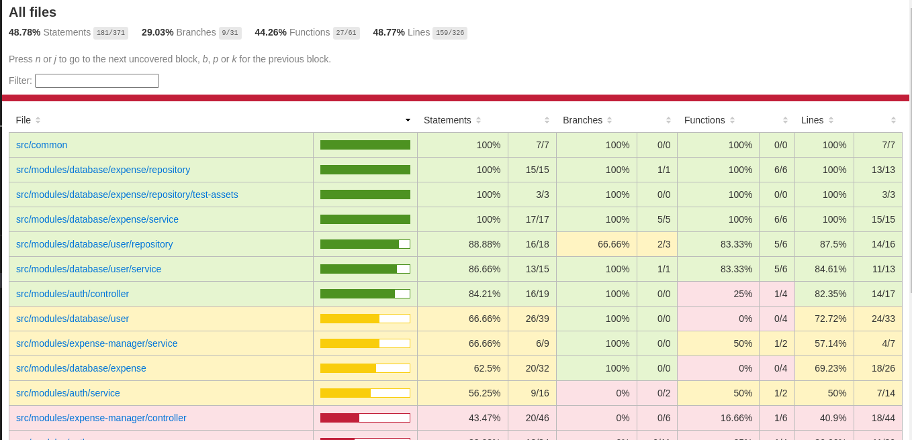

Serviço para gerenciamento de desespesas de viagem de acordo com as regras de negócio descritas no enunciado do teste.

Para iniciar a aplicação com uma instância do banco de dados e uma instância do redis através do docker-compose, rodar o comando `docker compose up -d`.

As migrations devem ser rodadas de forma manual, inclusive ao subir o container com uma imagem nova do banco de dados. O comando é `npm run migration:run`.

O token retornado para o login é um Bearer JWT.

---

Diagrama ER.

---

Coleção de requisições para o Insomnia (JSON) em assets/routes_insomnia.json

Documentação da API através do Swagger disponível na rota /api (HTML).

---

Cobertura de testes.

---

Enunciado:

"O teste

Desenvolver uma API REST com NestJS, implementando:

Autenticação de usuário.
CRUD de despesas.

A api deverá conter uma forma de Autenticação. (o CRUD deve estar protegido pela autenticação).

Na entidade despesas, deverá conter:

● Id
● Descrição (descrição da despesa)
● Data (data de quando ocorreu a despesa)
● Usuário (usuário dono da despesa, um relacionamento com a tabela de Usuários)
● Valor (valor em reais da despesa)

olocar validação nos requests do CRUD (usuário existe, data não é futuro, valor não é negativo, descrição tem até 191 caracteres). 

Colocar restrição de acessos nos requests do CRUD (somente o usuário relacionado a despesa pode acessar e agir sobre ela).

Ao cadastrar uma despesa, deverá ser enviado um e-mail para o usuário vinculado a despesa, com o título "despesa cadastrada". 

O teste pode ser realizado da forma que preferir, porém, a forma como for realizado o projeto será o ponto central da avaliação. Recomendamos implementar o projeto do jeito mais simples possível e seguir as boas práticas do Clean Code.

Algumas recomendações:

Fazer a validação da API utilizando o Class validator;
Documentação;
Não esqueça dos testes;"
