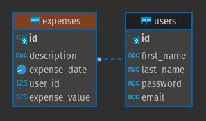
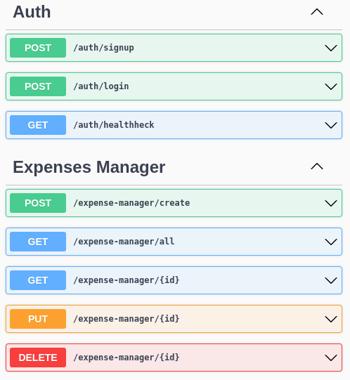

Serviço para gerenciamento de desespesas de viagem de acordo com as regras de negócio descritas no enunciado do teste.

Para iniciar a aplicação com uma instância do banco de dados e uma instância do redis através do docker-compose, rodar o comando `docker compose up -d`.

As migrations devem ser rodadas de forma manual, inclusive ao subir o container com uma imagem nova do banco de dados. O comando é `npm run migration:run`.

O token retornado para o login é um Bearer JWT.

Diagrama ER.

Documentação da API através do Swagger disponível na rota /api (HTML).

